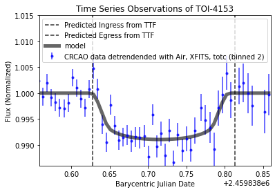

# Zachary Raup
---
[Link to CV:](CV_Raup_Z.pdf)

### About Me
Welcome to my data science portfolio. I graduated Summa Cum Laude from Kutztown University with a bachelor's degree in Physics, driven by an insatiable curiosity and a passion for data-driven exploration. Throughout my academic journey, I specialized in data analysis and modeling, particularly in the realms of exoplanets and binary stars. This experience not only deepened my understanding of complex datasets but also honed my skills in extracting meaningful insights.

Professionally, I have developed robust capabilities in Python for data analysis, leveraging techniques such as exploratory data analysis, data cleaning, and statistical modeling. I am proficient in SQL querying, adept at managing and extracting insights from large datasets to support data-driven decision-making. Additionally, I possess advanced skills in data visualization using Tableau and Power BI, creating insightful visualizations that effectively communicate findings and support strategic initiatives.

I am dedicated to applying my expertise in Python, SQL, and data visualization tools to solve challenging problems and contribute meaningfully to data-driven projects. I thrive in collaborative environments and am committed to continuous learning and professional growth in the dynamic field of data science.

&nbsp;  
---
##### Below is a select list of data and coding projects that I have completed:  
&nbsp;  
## [Project 1: Utilizing MCMC in Python to Explore the Parameter Space of an Exoplanet Transit](TOI4153_port.md)

#### Project Overview
##### This research project focuses on modeling the transit of exoplanets across stars using the Python package 'batman'. The objective was to accurately predict changes in stellar brightness during these transits, validated against photometry data from the CR Chambliss Astronomical Observatory. Methodologically, a physics-based model was developed and evaluated using a log likelihood function to fit observational data. The Markov Chain Monte Carlo (MCMC) algorithm, facilitated by 'emcee', enabled exploration of parameter uncertainties such as planet radius and transit timing. Visualizations created with matplotlib included light curves, histograms of parameter distributions, and a corner plot illustrating parameter correlations. Presenting findings at the 241st AAS meeting highlighted contributions to understanding exoplanet transit dynamics, crucial for advancing knowledge of planetary systems beyond our solar system.

#### Image 1:
##### Light curve of TOI-4153 data (CRCAO) and model (batman)
 

---
