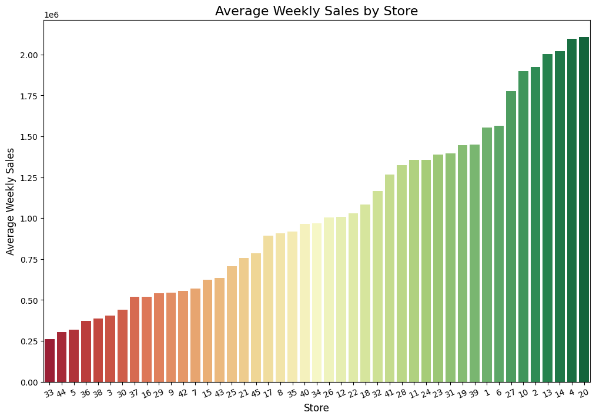
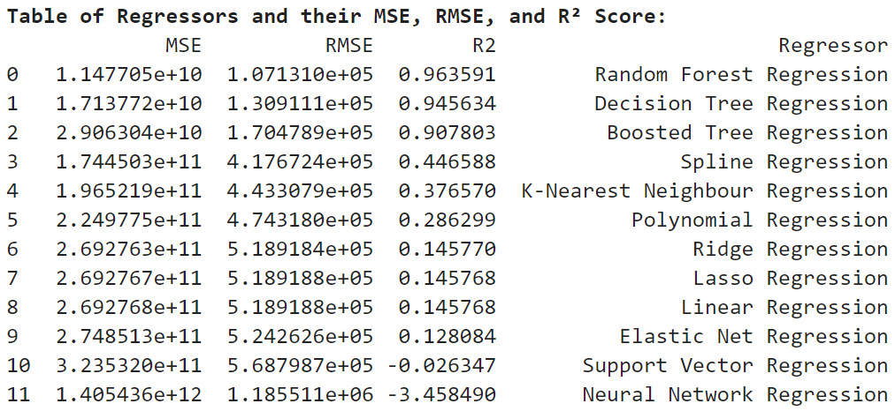

# Zachary Raup
--- 
  
[Zachary's Resume (pdf)](Res_Raup_Z.pdf)  
[Data Science Courses Completed](courses.md) 

### About Me
Welcome to my data science portfolio! I’m Zachary Raup, a dedicated and curious data scientist with a strong foundation in physics and a passion for uncovering insights through data. I graduated **Summa Cum Laude** from Kutztown University with a bachelor’s degree in Physics, where I specialized in data analysis and modeling—particularly in the fields of **exoplanets** and **binary star systems**. My research experience sharpened my analytical thinking and deepened my ability to work with complex, real-world datasets.

To build upon this foundation, I pursued professional development through DataCamp, earning certifications as a **Data Scientist Associate, Data Analyst Associate**, and receiving credentials in **Python** and **SQL**. I’ve also completed coursework in **machine learning, data preprocessing**, and **visualization**, equipping me with both the theoretical knowledge and hands-on skills needed to drive data-driven solutions.

In my work, I use Python for data exploration, feature engineering, statistical modeling, and machine learning, with libraries such as *pandas, scikit-learn, matplotlib*, and *numpy*. I'm also proficient in SQL, where I manage, query, and analyze large datasets efficiently to support decision-making. My visualization skills extend to tools like **Tableau** and **Power BI**, where I create compelling dashboards and storytelling visuals to communicate insights clearly and effectively.

I thrive in collaborative environments, enjoy solving challenging problems, and am committed to continuous learning in the fast-evolving world of data science. Whether I'm optimizing a machine learning model, developing a visualization, or diving into raw data, my goal is always to make a meaningful impact through data.

&nbsp;  

---

#### Certifications 
- [Data Scientist Associate](DataScienceCert.pdf)
- [Data Analyst Associate](DataAnalystCertificate.pdf)
- [Python Data Associate](PythonDataAssociateCert.pdf)
- [SQL Associate](SQL_cert.pdf)

---  

##### Below is a list of data and coding projects that I have completed. Use project title links to view more information about each project.  
&nbsp;  

### [Project 1](https://www.kaggle.com/code/zacharyraup/discovering-similar-songs)    
## [Discovering Similar Songs Using Machine Learning | Unsupervised Learning with Spotify Data](https://www.kaggle.com/code/zacharyraup/discovering-similar-songs)  

#### Project Overview
This project applies unsupervised machine learning techniques to uncover patterns in Spotify audio data and recommend musically similar songs. By using Non-negative Matrix Factorization (NMF) for dimensionality reduction and t-distributed Stochastic Neighbor Embedding (t-SNE) for visualization, the feature space of over 6,000 tracks was mapped into an interpretable 2D projection. Cosine similarity was then used to identify songs most similar to “Blinding Lights” by The Weekend. The final result is an insightful visual and analytical exploration of musical relationships based on audio characteristics..

###### Skills Applied: Unsupervised Learning, NMF, t-SNE, Cosine Similarity, Data Preprocessing, Python (scikit-learn, NumPy, pandas)

#### Image 1: This 2D visualization presents a t-SNE projection of the song dataset, with each point representing a track. Colors indicate cosine similarity to “Blinding Lights” by The Weeknd—green represents higher similarity, red represents lower. The 10 most similar songs are marked with square outlines, clearly highlighting clusters of tracks that share sonic traits. This approach visually demonstrates how audio features can be leveraged to identify stylistic similarity between songs.

#### Table 1: Top 10 Most Similar Songs to “Blinding Lights””
##### The table below lists the 10 songs most similar to “Blinding Lights”, based on cosine similarity of audio features. These tracks span multiple genres and artists, yet share core musical qualities such as synth-driven production, emotional tone, and modern pop energy. The diversity of artists—from Post Malone to K/DA—illustrates the reach of “Blinding Lights’” sonic profile.

 **Top 10 Similar Songs to: Blinding Lights - The Weekend**
- Blinding Lights (with ROSALÍA) — Remix - The Weekend, ROSALÍA (Similarity: 0.9988)
- I am not a woman, I'm a god — Halsey (Similarity: 0.9971)
- Feels Great (feat. Fetty Wap & CVBZ) — Cheat Codes, Fetty Wap, CVBZ (Similarity: 0.9951)
- Enough Is Enough — Post Malone (Similarity: 0.9939)
- MI FAI IMPAZZIRE — BLANCO, Sfera Ebbasta (Similarity: 0.9936)
- Last Day Alive — The Chainsmokers, Florida Georgia Line (Similarity: 0.9933)
- POP/STARS — K/DA, Madison Beer, (G)I-DLE, Jaira Burns, League of Legends (Similarity: 0.9931)
- Love It If We Made It — The 1975 (Similarity: 0.9929)
- When I’m Alone — Post Malone (Similarity: 0.9928)
- Together — Sia (Similarity: 0.9928)

 &nbsp;   

### [Project 2](Walmart_Sales_Prediction.md) 
## [Walmart Sales Prediction | Regression Modeling](Walmart_Sales_Prediction.md)  

#### Project Overview
Accurate weekly sales predictions are essential for retail businesses to manage inventory, forecast demand, and optimize profitability. This project explores the use of machine learning techniques to predict weekly sales for Walmart stores based on historical data spanning 2010 to 2012. Various regression models, including Random Forest, Boosted Trees, and Ridge Regression, were applied and compared to identify the most reliable approach for capturing complex data relationships and improving predictive accuracy.

###### Skills Applied: Machine Learning, Python (scikit-learn), Regression Modeling, Data Cleaning, Feature Engineering and more 

#### Image 2: Average Weekly Sales by Store and Regression Model Performance
##### The first chart visualizes the average weekly sales across all stores, revealing that stores like Store 4 and Store 20 consistently outperform others in sales volume, while stores such as Store 33 report the lowest averages. The second chart ranks the performance of various regression models based on RMSE. Random Forest Regression stands out with the lowest RMSE (107,130.99) and highest R² score (0.9636), demonstrating strong predictive accuracy. Decision Tree and Boosted Tree models also show solid performance, whereas linear and neural network models lag behind, highlighting the effectiveness of ensemble methods for this task.

    

 &nbsp;   

### [Project 3](PDML.md)  
## [Predicting Diabetes Using Machine Learning | Comparison of Classification Models](PDML.md)  

#### Project Overview
This project explores the effectiveness of five machine learning models—Logistic Regression, K-Nearest Neighbors (KNN), Decision Tree, Random Forest, and Support Vector Machine (SVM)—in predicting diabetes status using a cleaned patient dataset. By employing cross-validation and assessing key metrics such as accuracy, precision, recall, and F1 score, the analysis highlights the importance of selecting a model that balances these metrics for reliable healthcare applications. A model with high accuracy and recall is crucial for effectively identifying diabetic patients, thereby minimizing the risks associated with missed diagnoses. 

###### Skills Applied: Machine Learning, Supervised Learning, Python (scikit-learn), Cross-Validation, Hyperparameter Tuning and more 

#### Image 3: Classification Model Comparison
##### This boxplot illustrates the cross-validation accuracy of five classification models—Logistic Regression, K-Nearest Neighbors (KNN), Decision Tree, Random Forest, and Support Vector Machine (SVM). Each box represents the distribution of accuracy scores obtained through 5-fold cross-validation, highlighting the performance stability and variability of each model. The results emphasize the importance of model selection in achieving high accuracy for diabetes classification, crucial for effective healthcare decision-making.

  

 &nbsp;   

### [Project 4](TOI4153_port.md) 
## [Utilizing MCMC to Explore the Parameter Space of an Exoplanet Transit](TOI4153_port.md)  

#### Project Overview
This research project focuses on modeling the transit of exoplanets across stars using the Python package 'batman'. The objective was to accurately predict changes in stellar brightness during these transits, validated against photometry data from the CR Chambliss Astronomical Observatory (CRCAO). Methodologically, a physics-based model was developed and evaluated using a log likelihood function to fit observational data. The Markov Chain Monte Carlo (MCMC) algorithm, facilitated by 'emcee', enabled exploration of parameter uncertainties such as planet radius and transit timing. Visualizations created with matplotlib included light curves, histograms of parameter distributions, and a corner plot illustrating parameter correlations. Presenting findings at the 241st AAS meeting highlighted contributions to understanding exoplanet transit dynamics, crucial for advancing knowledge of planetary systems beyond our solar system.

###### Skills Applied: Python (pandas, matplotlib, numpy, emcee, & batman), Jupyter Notebook, and Excel  

#### Image 4: TOI-4153 modeled lightcurve
##### Light curve of TOI-4153 data (CRCAO) taken in a Blue (B) and Infrared (I) filter. The model is built using the Python transit modeler package 'batman'. The parameters of the model were determined using the Markov Chain Monte Carlo algorithm and known parameters taken from the [ExoFOP](https://exofop.ipac.caltech.edu/tess/target.php?id=470171739) database.

   
 

 &nbsp;   
   
### [Project 5](MySQL_port.md) 
## [Insights into Dog Behavior: Analyzing Dognition Data with MySQL](MySQL_port.md)  

#### Project Overview
The goal of this project is to utilize MySQL queries to perform analysis of trends and relationships embedded within the Dognition database. Developed as a fundamental component of the ‘Managing Big Data with MySQL’ course from Duke University, the project focuses on refining and applying skills in data cleaning, sorting, and employing advanced analytical techniques using SQL. By exploring large datasets such as the Dognition database, the project aims to uncover meaningful insights into canine behavior patterns and preferences, leveraging robust data management practices to extract actionable intelligence for further research and practical applications in understanding and enhancing dog-human interactions.

###### Skills Applied: MySQL, Writing Queries, Data Cleaning, and Big Data  

#### Image 5: Top States by Number of Dognition Users
##### This MySQL query analyzes geographical user trends within the Dognition dataset, resulting in a table that lists the top 5 states with the highest number of Dognition users.

   

 &nbsp;   

### [Project 6](MuesTabl.md) 
## [Interactive Animation of Museum Visitor Paths and Hourly Room Traffic in Tableau](MuesTabl.md)  

#### Project Overview
The project was undertaken as part of the 'Data Visualization in Tableau' course in Data Camp, where I applied advanced data visualization techniques to transform raw museum data into a meaningful and engaging interactive animation. By leveraging Tableau's powerful features, I was able to create a comprehensive and user-friendly tool that highlights key patterns and trends in museum visitor behavior by the hour. This project not only demonstrates my proficiency in using Tableau for data visualization but also underscores the practical application of these skills in real-world scenarios.

###### Skills Applied: Tableau, Data Visualization

#### Image 6: Common Musuem Visitor Paths
##### The following three screenshots highlight two popular paths that museum visitors walk at 11 AM, 3 PM, and 6 PM. These images illustrate how the average number of people in each area changes throughout the day, providing insights into visitor flow and behavior

  

 &nbsp;   

---
---  

###### Portfolio Links
[Zachary's Portfolio](README.md)  
[Project 1: Discovering Similar Songs using Machine Learning and Spotify](https://www.kaggle.com/code/zacharyraup/discovering-similar-songs)  
[Project 2: Regression Modeling | Walmart Sales Prediction](Walmart_Sales_Prediction.md)  
[Project 3: Predicting Diabetes Using Machine Learning | Comparison of Classification Models](PDML.md)  
[Project 4: Utilizing MCMC in Python to Explore the Parameter Space of an Exoplanet Transit](TOI4153_port.md)  
[Project 5: Insights into Dog Behavior: Analyzing Dognition Data with MySQL](MySQL_port.md)  
[Project 6: Interactive Animation of Museum Visitor Paths and Hourly Room Traffic in Tableau](MuesTabl.md)  

