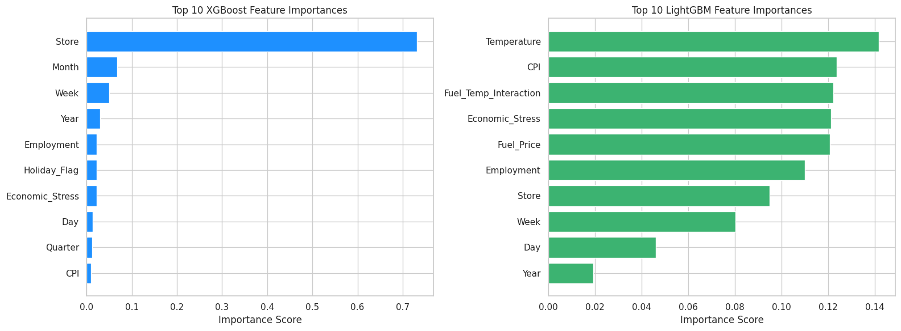

# Zachary Raup
--- 
  
[Zachary's Resume (pdf)](Res_Raup_Z.pdf)  
[Data Science Courses Completed](courses.md) 

### About Me
Welcome to my data science portfolio! I'm **Zachary Raup**, a data scientist with a strong foundation in physics and a passion for uncovering insights from complex datasets. I graduated Summa Cum Laude from Kutztown University with a B.S. in Physics, where I focused on data modeling in astrophysical systems—particularly exoplanets and binary stars. This research experience trained me to approach problems analytically, work with real-world uncertainty, and extract meaning from noisy data.

To strengthen my data science skillset, I earned certifications from **DataCamp** in Data Science, Data Analysis, **Python**, and **SQL**, and completed coursework in **machine learning, data preprocessing**, and **visualization**. I apply these skills using Python (pandas, scikit-learn, matplotlib, numpy) and SQL, with additional proficiency in **Tableau** and **Power BI** for data storytelling.

My work focuses on building interpretable, performance-driven models to support real-world decision-making. I enjoy collaborating across disciplines, turning messy data into actionable insight, and constantly learning new techniques to grow as a scientist and developer.

Thanks for visiting—feel free to explore my projects!

&nbsp;  

---

#### Certifications 
- [Data Scientist Associate](DataScienceCert.pdf)
- [Data Analyst Associate](DataAnalystCertificate.pdf)
- [Python Data Associate](PythonDataAssociateCert.pdf)
- [SQL Associate](SQL_cert.pdf)

---  

##### Below is a list of data and coding projects that I have completed. Use project title links to view more information about each project.  
&nbsp;  

### [Project 1](https://www.kaggle.com/code/zacharyraup/deep-learning-chest-x-ray-pneumonia-detection) 
## [Chest X-Ray Pneumonia Detection with Deep Learning](https://www.kaggle.com/code/zacharyraup/deep-learning-chest-x-ray-pneumonia-detection) 

#### Project Overview
Developed a deep learning pipeline to classify chest X-rays as Normal or Pneumonia using an ensemble of pretrained CNNs (ResNet18, DenseNet121, EfficientNet-B0). Achieved a 91.2% test accuracy and an F1-score of 0.9332, with all models demonstrating high pneumonia recall, minimizing false negatives.

*Key components*:
- Implemented 3-fold stratified cross-validation and early stopping to ensure robust model performance
- Applied class-weighted loss functions to address class imbalance during training
- Integrated Grad-CAM visualizations to highlight key diagnostic regions and enhance interpretability for clinical use

This project showcases how deep learning and explainable AI can support radiologists by improving diagnostic accuracy and transparency in medical imaging.

###### Skills Applied: PyTorch, Convolutional Neural Networks (CNN), Computer Vision, Deep Learning, Medical Imaging, Scikit-Learn and more

#### Figure 1: Grad-CAM Heatmap: Interpretable Pneumonia Detection from Chest X-Ray
##### Grad-CAM visualization for a test chest X-ray correctly classified as Pneumonia by the ResNet18 model. The highlighted activation regions (in red and yellow) suggest the model focuses on areas of increased radiographic opacity within the central and lower lung fields—features often indicative of pulmonary infection. This supports the model's decision-making process and provides interpretability in a clinical context.

  

#### Figure 2: Confusion Matrix: ResNet18 Model on Chest X-Ray Test Set
##### Confusion matrix for the ResNet18 model (fold 0) evaluated on the test set. The model correctly identified 384 of 390 Pneumonia cases (high sensitivity) and 185 of 234 Normal cases, resulting in 6 false negatives and 49 false positives. This performance highlights the model’s strong bias toward minimizing missed Pneumonia diagnoses, a clinically preferred trade-off in high-stakes triage settings.

  

&nbsp;  

### [Project 2](https://www.kaggle.com/code/zacharyraup/forecasting-retail-sales-with-machine-learning) 
## [Forecasting Retail Sales with Machine Learning | Regression Modeling](https://www.kaggle.com/code/zacharyraup/forecasting-retail-sales-with-machine-learning)

#### Project Overview
Accurate weekly sales predictions are crucial for large-scale retailers like Walmart to optimize **inventory management**, **labor allocation**, and **supply chain planning**. This project uses historical sales data (2010–2012) to build a machine learning pipeline that predicts weekly sales using a blend of **store-level**, **temporal**, and **economic features**. After thorough **EDA**, feature engineering, and model tuning, five regression algorithms were evaluated, with **XGBoost and LightGBM** demonstrating top performance.

Key goals included:
- Comparing **linear vs. non-linear models** (Ridge, Decision Tree, Random Forest, XGBoost, LightGBM),
- Enhancing model **generalizability** through 5-fold **cross-validation**,
- Improving **interpretability** via residual diagnostics and **feature importance visualization**.

> **Best Model**: XGBoost with RMSE ≈ **$61.4K** and R² ≈ **0.988** on the test set  
> **Notable Insight**: Holiday weeks and store-specific trends were the strongest predictors of weekly sales variability

###### **Skills Applied:** Python (pandas, scikit-learn, xgboost, lightgbm), Regression Modeling, Cross-Validation, Residual Analysis, EDA, Feature Engineering, Data Cleaning, Visualization

#### Figure 3: Actual vs Predicted Weekly Sales – XGBoost vs LightGBM  
##### This dual-panel plot compares predicted weekly sales to actual values for the two best-performing models. **XGBoost** (left) shows a strong fit with tightly clustered points near the diagonal, indicating accurate forecasts and low bias. **LightGBM** (right) also performs well but with slightly more spread, particularly at higher sales values.

#### Figure 4: Feature Importance – XGBoost vs LightGBM  
##### This figure compares the top 10 features driving predictions in both models. XGBoost heavily prioritizes the **Store** variable, revealing strong store-specific effects. LightGBM distributes importance more evenly across predictors such as **Temperature**, **Fuel_Temp_Interaction**, and **Economic_Stress**, suggesting broader generalizability.

 &nbsp;   

### [Project 3](https://www.kaggle.com/code/zacharyraup/discovering-similar-songs)    
## [Discovering Similar Songs Using Machine Learning | Unsupervised Learning with Spotify Data](https://www.kaggle.com/code/zacharyraup/discovering-similar-songs)  

#### Project Overview
This project applies unsupervised machine learning techniques to uncover patterns in Spotify audio data and recommend musically similar songs. By using Non-negative Matrix Factorization (NMF) for dimensionality reduction and t-distributed Stochastic Neighbor Embedding (t-SNE) for visualization, the feature space of over 6,000 tracks was mapped into an interpretable 2D projection. Cosine similarity was then used to identify songs most similar to “Blinding Lights” by The Weekend. The final result is an insightful visual and analytical exploration of musical relationships based on audio characteristics..

###### Skills Applied: Unsupervised Learning, NMF, t-SNE, Cosine Similarity, Data Preprocessing, Python (scikit-learn, NumPy, pandas)

#### Figure 5: Interactive Projection of Songs Colored by Similarity to Blinding Lights - The Weekend
##### This 2D visualization presents a t-SNE projection of the song dataset, with each point representing a track. Colors indicate cosine similarity to “Blinding Lights” by The Weeknd—green represents higher similarity, red represents lower. The 10 most similar songs are marked with square outlines, clearly highlighting clusters of tracks that share sonic traits. This approach visually demonstrates how audio features can be leveraged to identify stylistic similarity between songs.

#### Table 1: Top 10 Most Similar Songs to “Blinding Lights””
##### The table below lists the 10 songs most similar to “Blinding Lights”, based on cosine similarity of audio features. These tracks span multiple genres and artists, yet share core musical qualities such as synth-driven production, emotional tone, and modern pop energy. The diversity of artists—from Post Malone to K/DA—illustrates the reach of “Blinding Lights’” sonic profile.

 **Top 10 Similar Songs to: Blinding Lights - The Weekend**
- Blinding Lights (with ROSALÍA) — Remix - The Weekend, ROSALÍA (Similarity: 0.9988)
- I am not a woman, I'm a god — Halsey (Similarity: 0.9971)
- Feels Great (feat. Fetty Wap & CVBZ) — Cheat Codes, Fetty Wap, CVBZ (Similarity: 0.9951)
- Enough Is Enough — Post Malone (Similarity: 0.9939)
- MI FAI IMPAZZIRE — BLANCO, Sfera Ebbasta (Similarity: 0.9936)
- Last Day Alive — The Chainsmokers, Florida Georgia Line (Similarity: 0.9933)
- POP/STARS — K/DA, Madison Beer, (G)I-DLE, Jaira Burns, League of Legends (Similarity: 0.9931)
- Love It If We Made It — The 1975 (Similarity: 0.9929)
- When I’m Alone — Post Malone (Similarity: 0.9928)
- Together — Sia (Similarity: 0.9928)

 &nbsp;   

### [Project 4](https://www.kaggle.com/code/zacharyraup/predictive-maintenance-in-manufacturing)
## [Predictive Maintenance in Manufacturing | Machine Failure Classification with XGBoost](https://www.kaggle.com/code/zacharyraup/predictive-maintenance-in-manufacturing)  

#### Project Overview
Developed a machine learning pipeline to detect machine failures in a manufacturing environment using sensor data. Feature engineering and class rebalancing were applied to improve signal extraction and model fairness. Compared Logistic Regression, Random Forest, and XGBoost, with the latter achieving **98.6% accuracy** and perfect AUC on the test set.

*Key components*:
- Created engineered features including `Power`, `Temp_Delta`, `Speed_Torque_Ratio`, and `Wear_per_Torque`
- Applied SMOTE to correct class imbalance (only 339 failure cases among 10,000+ observations)
- Used SHAP for global and local model interpretability
- Achieved a strong balance of precision and recall, reducing false positives and false negatives

This project demonstrates how domain knowledge, feature construction, and ensemble methods can work together to create a reliable and explainable predictive maintenance solution.

###### Skills Applied: Machine Learning, Feature Engineering, SMOTE, SHAP, Ensemble Modeling, Supervised Learning, Python (scikit-learn, XGBoost, imbalanced-learn)

#### Figure 6: Confusion Matrix — XGBoost Model
##### This confusion matrix shows the performance of the XGBoost model in detecting machine failures. It achieved 98.6% accuracy, with only 55 total misclassifications out of 3,865 samples. The model demonstrates excellent precision and recall, making it highly effective for predictive maintenance tasks in manufacturing.

#### Figure 7: SHAP Summary Plot — Feature Impact on Predictions
##### SHAP summary plot showing how each feature influences the model’s predictions. Tool_wear_[min], Power_[W], and Rotational_speed_[rpm] are among the most influential inputs. This visualization aids in validating model behavior and supports communication with non-technical stakeholders.

 &nbsp;   

<!--  
% Start Comment Out Section

### [Project 5](PDML.md)  
## [Predicting Diabetes Using Machine Learning | Comparison of Classification Models](PDML.md)  

#### Project Overview
This project explores the effectiveness of five machine learning models—Logistic Regression, K-Nearest Neighbors (KNN), Decision Tree, Random Forest, and Support Vector Machine (SVM)—in predicting diabetes status using a cleaned patient dataset. By employing cross-validation and assessing key metrics such as accuracy, precision, recall, and F1 score, the analysis highlights the importance of selecting a model that balances these metrics for reliable healthcare applications. A model with high accuracy and recall is crucial for effectively identifying diabetic patients, thereby minimizing the risks associated with missed diagnoses. 

###### Skills Applied: Machine Learning, Supervised Learning, Python (scikit-learn), Cross-Validation, Hyperparameter Tuning and more 

#### Figure 7: Classification Model Comparison
##### This boxplot illustrates the cross-validation accuracy of five classification models—Logistic Regression, K-Nearest Neighbors (KNN), Decision Tree, Random Forest, and Support Vector Machine (SVM). Each box represents the distribution of accuracy scores obtained through 5-fold cross-validation, highlighting the performance stability and variability of each model. The results emphasize the importance of model selection in achieving high accuracy for diabetes classification, crucial for effective healthcare decision-making.

  

 &nbsp;   

### [Project 6](TOI4153_port.md) 
## [Utilizing MCMC to Explore the Parameter Space of an Exoplanet Transit](TOI4153_port.md)  

#### Project Overview
This research project focuses on modeling the transit of exoplanets across stars using the Python package 'batman'. The objective was to accurately predict changes in stellar brightness during these transits, validated against photometry data from the CR Chambliss Astronomical Observatory (CRCAO). Methodologically, a physics-based model was developed and evaluated using a log likelihood function to fit observational data. The Markov Chain Monte Carlo (MCMC) algorithm, facilitated by 'emcee', enabled exploration of parameter uncertainties such as planet radius and transit timing. Visualizations created with matplotlib included light curves, histograms of parameter distributions, and a corner plot illustrating parameter correlations. Presenting findings at the 241st AAS meeting highlighted contributions to understanding exoplanet transit dynamics, crucial for advancing knowledge of planetary systems beyond our solar system.

###### Skills Applied: Python (pandas, matplotlib, numpy, emcee, & batman), Jupyter Notebook, and Excel  

#### Figure 8: TOI-4153 Modeled Lightcurve
##### Light curve of TOI-4153 data (CRCAO) taken in a Blue (B) and Infrared (I) filter. The model is built using the Python transit modeler package 'batman'. The parameters of the model were determined using the Markov Chain Monte Carlo algorithm and known parameters taken from the [ExoFOP](https://exofop.ipac.caltech.edu/tess/target.php?id=470171739) database.

   
 

 &nbsp;   
   
### [Project 7](MySQL_port.md) 
## [Insights into Dog Behavior: Analyzing Dognition Data with MySQL](MySQL_port.md)  

#### Project Overview
The goal of this project is to utilize MySQL queries to perform analysis of trends and relationships embedded within the Dognition database. Developed as a fundamental component of the ‘Managing Big Data with MySQL’ course from Duke University, the project focuses on refining and applying skills in data cleaning, sorting, and employing advanced analytical techniques using SQL. By exploring large datasets such as the Dognition database, the project aims to uncover meaningful insights into canine behavior patterns and preferences, leveraging robust data management practices to extract actionable intelligence for further research and practical applications in understanding and enhancing dog-human interactions.

###### Skills Applied: MySQL, Writing Queries, Data Cleaning, and Big Data  

#### Figure 9: Top States by Number of Dognition Users
##### This MySQL query analyzes geographical user trends within the Dognition dataset, resulting in a table that lists the top 5 states with the highest number of Dognition users.

   

 &nbsp;   

### [Project 8](MuesTabl.md) 
## [Interactive Animation of Museum Visitor Paths and Hourly Room Traffic in Tableau](MuesTabl.md)  

#### Project Overview
The project was undertaken as part of the 'Data Visualization in Tableau' course in Data Camp, where I applied advanced data visualization techniques to transform raw museum data into a meaningful and engaging interactive animation. By leveraging Tableau's powerful features, I was able to create a comprehensive and user-friendly tool that highlights key patterns and trends in museum visitor behavior by the hour. This project not only demonstrates my proficiency in using Tableau for data visualization but also underscores the practical application of these skills in real-world scenarios.

###### Skills Applied: Tableau, Data Visualization

#### Figure 10: Common Musuem Visitor Paths
##### The following three screenshots highlight two popular paths that museum visitors walk at 11 AM, 3 PM, and 6 PM. These images illustrate how the average number of people in each area changes throughout the day, providing insights into visitor flow and behavior

  

% End Comment Out Section
-->   

 &nbsp;   

---
---  

###### Portfolio Links
[Zachary's Portfolio](README.md)  
[Project 1: Chest X-Ray Pneumonia Detection with Deep Learning](https://www.kaggle.com/code/zacharyraup/deep-learning-chest-x-ray-pneumonia-detection)  
[Project 2: Forecasting Retail Sales with Machine Learning | Regression Modeling](https://www.kaggle.com/code/zacharyraup/forecasting-retail-sales-with-machine-learning)  
[Project 3: Discovering Similar Songs using Machine Learning and Spotify](https://www.kaggle.com/code/zacharyraup/discovering-similar-songs)  
[Project 4: Predictive Maintenance in Manufacturing](https://www.kaggle.com/code/zacharyraup/predictive-maintenance-in-manufacturing)  

<!--

% [Project 5: Predicting Diabetes Using Machine Learning | Comparison of Classification Models](PDML.md)  
% [Project 6: Utilizing MCMC in Python to Explore the Parameter Space of an Exoplanet Transit](TOI4153_port.md)  
% [Project 7: Insights into Dog Behavior: Analyzing Dognition Data with MySQL](MySQL_port.md)  
% [Project 8: Interactive Animation of Museum Visitor Paths and Hourly Room Traffic in Tableau](MuesTabl.md)  

% End Comment Out Section
--> 

