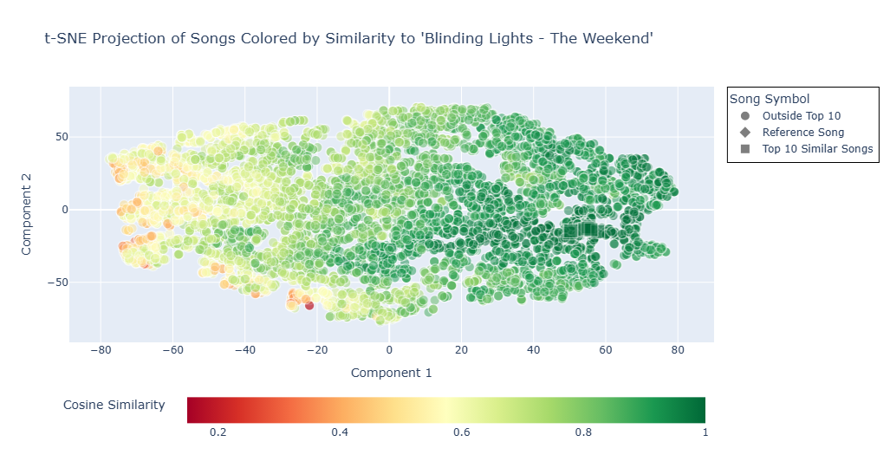

# Zachary Raup
---
[Zachary's Resume (pdf)](Res_Raup_Z.pdf)  
[Data Science Courses Completed](courses.md)  

### About Me
Welcome to my data science portfolio! I graduated Summa Cum Laude from Kutztown University with a bachelor’s degree in Physics, driven by an insatiable curiosity and a passion for data-driven exploration. Throughout my academic journey, I specialized in data analysis and modeling, particularly in the realms of exoplanets and binary stars. This experience not only deepened my understanding of complex datasets but also honed my skills in extracting meaningful insights.

I hold certifications as a Data Science Associate and Data Analyst Associate from DataCamp, along with specialized certifications in Python and SQL. My coursework has also included advanced machine learning topics, equipping me with a solid foundation in both theoretical concepts and practical applications.

Professionally, I have developed robust capabilities in Python for data science, leveraging techniques such as exploratory data analysis, data cleaning, and statistical modeling. I am proficient in SQL querying, adept at managing and extracting insights from large datasets to support data-driven decision-making. Additionally, I possess advanced skills in data visualization using Tableau and Power BI, creating insightful visualizations that effectively communicate findings and support strategic initiatives.

I am dedicated to applying my expertise in Python, SQL, and data visualization tools to solve challenging problems and contribute meaningfully to data-driven projects. I thrive in collaborative environments and am committed to continuous learning and professional growth in the dynamic field of data science.

&nbsp;  

---

#### Certifications 
- [Data Scientist Associate](DataScienceCert.pdf)
- [Data Analyst Associate](DataAnalystCertificate.pdf)
- [Python Data Associate](PythonDataAssociateCert.pdf)
- [SQL Associate](SQL_cert.pdf)

---  

##### Below is a list of data and coding projects that I have completed. Use project title links to view more information about each project.  
&nbsp;  

## [Discovering Similar Songs Using Machine Learning | Unsupervised Learning with Spotify Data](https://www.kaggle.com/code/zacharyraup/discovering-similar-songs-using-machine-learning-a)  

#### Project Overview
This project explores the use of unsupervised learning and dimensionality reduction techniques to analyze and visualize the similarity between songs based on audio characteristics available from Spotify. By applying preprocessing, feature engineering, and advanced techniques like Non-negative Matrix Factorization (NMF) and t-distributed Stochastic Neighbor Embedding (t-SNE), I created an interactive, interpretable map of songs, with a focus on comparing all tracks to "Blinding Lights" by The Weeknd.

###### Skills Applied: Unsupervised Machine Learning, Python (scikit-learn), Cosine Similarity, NMF, t-SNE and more 

#### Image 1: t-SNE Projection of Spotify Tracks Based on Audio Features
##### This visualization displays a two-dimensional t-SNE projection of over 6,000 songs from Spotify, where each point represents a song and is colored by its cosine similarity to "Blinding Lights" by The Weeknd. Audio features were normalized and reduced using Non-negative Matrix Factorization (NMF) before applying t-SNE. Shapes indicate song relevance: circles for general tracks, a diamond for the reference song, and squares for the top 10 most similar tracks. The color gradient highlights how closely a song matches the reference based on key musical characteristics.

🎵 Top 10 Similar Songs to: Blinding Lights - The Weekend
Blinding Lights (with ROSALÍA) — Remix - The Weekend, ROSALÍA (Similarity: 0.9988)
I am not a woman, I'm a god — Halsey (Similarity: 0.9971)
Feels Great (feat. Fetty Wap & CVBZ) — Cheat Codes, Fetty Wap, CVBZ (Similarity: 0.9951)
Enough Is Enough — Post Malone (Similarity: 0.9939)
MI FAI IMPAZZIRE — BLANCO, Sfera Ebbasta (Similarity: 0.9936)
Last Day Alive — The Chainsmokers, Florida Georgia Line (Similarity: 0.9933)
POP/STARS — K/DA, Madison Beer, (G)I-DLE, Jaira Burns, League of Legends (Similarity: 0.9931)
Love It If We Made It — The 1975 (Similarity: 0.9929)
When I’m Alone — Post Malone (Similarity: 0.9928)
Together — Sia (Similarity: 0.9928)

 &nbsp;   

## [Walmart Sales Prediction | Regression Modeling](Walmart_Sales_Prediction.md)  

#### Project Overview
Accurate weekly sales predictions are essential for retail businesses to manage inventory, forecast demand, and optimize profitability. This project explores the use of machine learning techniques to predict weekly sales for Walmart stores based on historical data spanning 2010 to 2012. Various regression models, including Random Forest, Boosted Trees, and Ridge Regression, were applied and compared to identify the most reliable approach for capturing complex data relationships and improving predictive accuracy.

###### Skills Applied: Machine Learning, Python (scikit-learn), Regression Modeling, Data Cleaning, Feature Engineering and more 

#### Image 2: Average Weekly Sales by Store and Regression Model Performance
##### The first chart visualizes the average weekly sales across all stores, revealing that stores like Store 4 and Store 20 consistently outperform others in sales volume, while stores such as Store 33 report the lowest averages. The second chart ranks the performance of various regression models based on RMSE. Random Forest Regression stands out with the lowest RMSE (107,130.99) and highest R² score (0.9636), demonstrating strong predictive accuracy. Decision Tree and Boosted Tree models also show solid performance, whereas linear and neural network models lag behind, highlighting the effectiveness of ensemble methods for this task.

    

 &nbsp;   

## [Predicting Diabetes Using Machine Learning | Comparison of Classification Models](PDML.md)  

#### Project Overview
This project explores the effectiveness of five machine learning models—Logistic Regression, K-Nearest Neighbors (KNN), Decision Tree, Random Forest, and Support Vector Machine (SVM)—in predicting diabetes status using a cleaned patient dataset. By employing cross-validation and assessing key metrics such as accuracy, precision, recall, and F1 score, the analysis highlights the importance of selecting a model that balances these metrics for reliable healthcare applications. A model with high accuracy and recall is crucial for effectively identifying diabetic patients, thereby minimizing the risks associated with missed diagnoses. 

###### Skills Applied: Machine Learning, Supervised Learning, Python (scikit-learn), Cross-Validation, Hyperparameter Tuning and more 

#### Image 3: Classification Model Comparison
##### This boxplot illustrates the cross-validation accuracy of five classification models—Logistic Regression, K-Nearest Neighbors (KNN), Decision Tree, Random Forest, and Support Vector Machine (SVM). Each box represents the distribution of accuracy scores obtained through 5-fold cross-validation, highlighting the performance stability and variability of each model. The results emphasize the importance of model selection in achieving high accuracy for diabetes classification, crucial for effective healthcare decision-making.

  

 &nbsp;   

## [Utilizing MCMC to Explore the Parameter Space of an Exoplanet Transit](TOI4153_port.md)  

#### Project Overview
This research project focuses on modeling the transit of exoplanets across stars using the Python package 'batman'. The objective was to accurately predict changes in stellar brightness during these transits, validated against photometry data from the CR Chambliss Astronomical Observatory (CRCAO). Methodologically, a physics-based model was developed and evaluated using a log likelihood function to fit observational data. The Markov Chain Monte Carlo (MCMC) algorithm, facilitated by 'emcee', enabled exploration of parameter uncertainties such as planet radius and transit timing. Visualizations created with matplotlib included light curves, histograms of parameter distributions, and a corner plot illustrating parameter correlations. Presenting findings at the 241st AAS meeting highlighted contributions to understanding exoplanet transit dynamics, crucial for advancing knowledge of planetary systems beyond our solar system.

###### Skills Applied: Python (pandas, matplotlib, numpy, emcee, & batman), Jupyter Notebook, and Excel  

#### Image 4: TOI-4153 modeled lightcurve
##### Light curve of TOI-4153 data (CRCAO) taken in a Blue (B) and Infrared (I) filter. The model is built using the Python transit modeler package 'batman'. The parameters of the model were determined using the Markov Chain Monte Carlo algorithm and known parameters taken from the [ExoFOP](https://exofop.ipac.caltech.edu/tess/target.php?id=470171739) database.

   
 

 &nbsp;   
   

## [Insights into Dog Behavior: Analyzing Dognition Data with MySQL](MySQL_port.md)  

#### Project Overview
The goal of this project is to utilize MySQL queries to perform analysis of trends and relationships embedded within the Dognition database. Developed as a fundamental component of the ‘Managing Big Data with MySQL’ course from Duke University, the project focuses on refining and applying skills in data cleaning, sorting, and employing advanced analytical techniques using SQL. By exploring large datasets such as the Dognition database, the project aims to uncover meaningful insights into canine behavior patterns and preferences, leveraging robust data management practices to extract actionable intelligence for further research and practical applications in understanding and enhancing dog-human interactions.

###### Skills Applied: MySQL, Writing Queries, Data Cleaning, and Big Data  

#### Image 5: Top States by Number of Dognition Users
##### This MySQL query analyzes geographical user trends within the Dognition dataset, resulting in a table that lists the top 5 states with the highest number of Dognition users.

   

 &nbsp;   
 
## [Interactive Animation of Museum Visitor Paths and Hourly Room Traffic in Tableau](MuesTabl.md)  

#### Project Overview
The project was undertaken as part of the 'Data Visualization in Tableau' course in Data Camp, where I applied advanced data visualization techniques to transform raw museum data into a meaningful and engaging interactive animation. By leveraging Tableau's powerful features, I was able to create a comprehensive and user-friendly tool that highlights key patterns and trends in museum visitor behavior by the hour. This project not only demonstrates my proficiency in using Tableau for data visualization but also underscores the practical application of these skills in real-world scenarios.

###### Skills Applied: Tableau, Data Visualization

#### Image 6: Common Musuem Visitor Paths
##### The following three screenshots highlight two popular paths that museum visitors walk at 11 AM, 3 PM, and 6 PM. These images illustrate how the average number of people in each area changes throughout the day, providing insights into visitor flow and behavior

  

 &nbsp;   

---
---  

###### Portfolio Links
[Zachary's Portfolio](README.md)  
[Discovering Similar Songs using Machine Learning and Spotify]([https://www.kaggle.com/code/zacharyraup/discovering-similar-songs-using-machine-learning-a])  
[Regression Modeling | Walmart Sales Prediction](Walmart_Sales_Prediction.md)  
[Predicting Diabetes Using Machine Learning | Comparison of Classification Models](PDML.md)  
[Utilizing MCMC in Python to Explore the Parameter Space of an Exoplanet Transit](TOI4153_port.md)  
[Insights into Dog Behavior: Analyzing Dognition Data with MySQL](MySQL_port.md)  
[Interactive Animation of Museum Visitor Paths and Hourly Room Traffic in Tableau](MuesTabl.md)  

