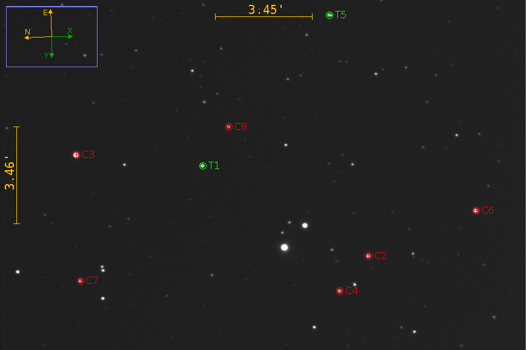
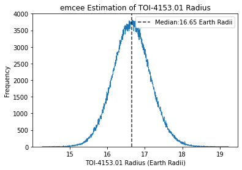
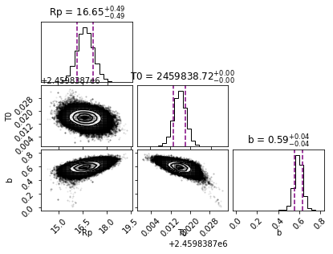
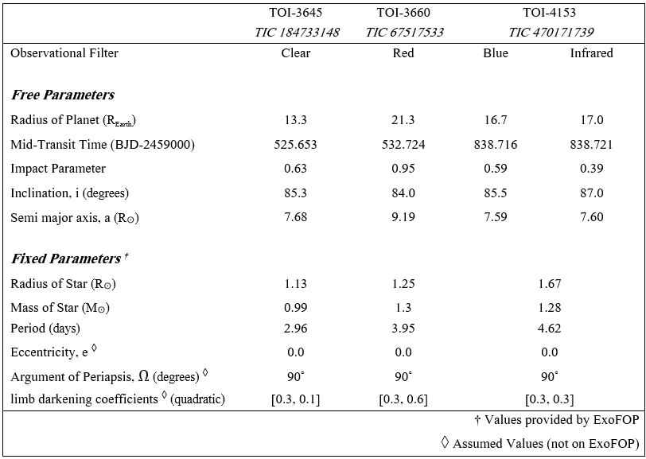
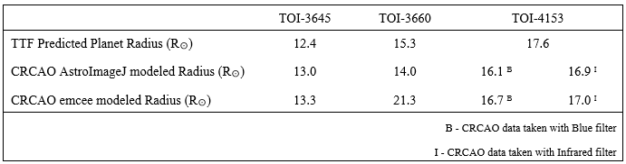

# Utilizing MCMC in Python to Explore the Parameter Space of an Exoplanet
###### By: Zachary Raup


### Objective:
The objective of this research project is to model the transit of an exoplanet across its host star using photometry data collected from the CR Chambliss Astronomical Observatory (CRCAO). The goal is to accurately estimate the radius of the transiting exoplanet. To achieve this, a log-likelihood function and the Markov Chain Monte Carlo (MCMC) algorithm were implemented to estimate various parameter values, including the exoplanet's radius. These parameters were then used to build a comprehensive model of the planetary star system based on the observational data. The model aims to analyze changes in the star's brightness (flux) during transits and assess its accuracy by comparing it against the observed photometry data from CRCAO.  

### Methodology:
The methodology for this research involves developing a physics-based model using the Python package 'batman' to simulate exoplanet transits. A log-likelihood function was used to quantify the model's fit to the observational data collected from the CRCAO. To estimate the model parameters, including the exoplanet's radius, impact parameter, and time of mid-transit, the Markov Chain Monte Carlo (MCMC) algorithm is implemented using the 'emcee' package. This algorithm samples from the posterior distribution of the model parameters, allowing for a thorough exploration of the parameter space and providing estimates of the uncertainties associated with these key parameters. This approach ensures a robust analysis of the photometry data, enabling accurate modeling of the exoplanet transits and reliable estimation of the planetary system parameters.

### Data: 
The primary data source for this project is photometry data of TESS Object of Interest (TOI)-4153 taken from the CRCAO at Kutztown University in Kutztown, PA. The data was collected on September 16, 2022 in two different filters, blue, and infrared. These observational data points are crucial for refining the exoplanet transit model and validating its accuracy against real-world observations.

### Visualization: 
Visualization of the research findings is achieved through the use of the Python package 'matplotlib'. This includes generating light curves that illustrate how the star's brightness changes over time during exoplanet transits. Additionally, histograms are used to visualize the probability distributions of model parameters, providing insights into uncertainties and likelihoods associated with each parameter estimation. A corner plot is used to depict correlations and interactions between different model parameters, offering a comprehensive view of the model's complexity and relationships.

### Presentation: 
I had the opportunity to present the entirety of this research project at the 241st AAS (American Astronomical Society) conference meeting in Seattle, WA. The presentation included clear and informative visualizations that effectively communicated the quality of the model fit and the implications of the project's results. These visual aids highlighted quantitative insights into parameter uncertainties and validated the model against observational data from the CRCAO. The goal was to provide a robust analysis of exoplanet transit dynamics, thereby contributing to our understanding of planetary systems beyond our solar system.


```python

```

  
### Key Components  
##### Exoplanet Transit Modeling:
Using the Python package 'batman', I developed a model to simulate the transit of exoplanet TOI-4153.01 across its host star. This model employs physics-based equations and systematic parameters to predict how the star's brightness changes from the observer's perspective as the exoplanet passes in front of the star, an event known as a transit. Exoplanet transits provide crucial details about the potential size of the exoplanet.

##### Log Likelihood Function:
The log-likelihood function is a concept in statistical inference and is used to estimate the parameters of a statistical model. For exoplanet photometry, the log-likelihood function is particularly useful for fitting models to observed data, such as the transit light curve of an exoplanet. The log likelihood function quantifies how well the exoplanet transit model fits observed photometry data collected from the CRCAO. This function is crucial for assessing the statistical likelihood of different parameter values within the model.

##### MCMC Implementation:
To estimate the model parameters and their uncertainties, I utilized the Python package 'emcee' to implement the Markov Chain Monte Carlo (MCMC) algorithm. This algorithm samples from the posterior distribution of model parameters, given the photometry data collected from the CRCAO. Using prior known parameter values from the Exoplanet Follow-up Observing Program [(ExoFOP) database](https://exofop.ipac.caltech.edu/tess/target.php?id=470171739), the MCMC algorithm explores the parameter space to provide robust estimates and quantify uncertainties. This approach is particularly useful for refining the estimates of key parameters such as the exoplanet’s radius, impact parameter, and time of mid-transit, ensuring a comprehensive understanding of the exoplanet's characteristics.

##### Visualization:
To visualize the results of the exoplanet transit model, I utilized the Python package 'matplotlib' to generate several types of plots:

- Light Curve: These plots illustrate how the brightness of the star changes over time during the exoplanet transit, providing a direct representation of the modeled data against observed photometry data.

- Parameter Posterior Distributions: Histograms were employed to display the posterior distributions of each free parameter in the MCMC algorithm (such as planet radius, impact parameter, and time of mid-transit). These distributions offer insights into the uncertainties and likelihoods associated with each parameter estimation.

- Corner Plot: A corner plot was used to visualize the correlations and parameter space relationships between different model parameters. This type of plot aids in understanding how changes in one parameter affect others, offering a comprehensive view of the model's complexity.

These visualizations play a crucial role in assessing the quality of the model fit and effectively communicating the findings of the study. They provide both quantitative insights into parameter uncertainties and qualitative validation against observational data from the CR Chambliss Astronomical Observatory.


```python

```


##  Exoplanet Information
###  TOI-4153.01 | TIC 470171739 

TOI-4153 is a yellowish-white F-type star with a temperature of 6411K, as listed in the [ExoFOP database](https://exofop.ipac.caltech.edu/tess/target.php?id=470171739). The star has a radius of 1.7 times that of the Sun and a mass of 1.3 times that of the Sun. TOI-4153 hosts one known exoplanet, designated TOI-4153.01, which orbits the star with a period of 4.6 days. 

##### Image 1: CRCAO Photomtry Data Image
The CRCAO data image from September 16, 2022, was taken with an infrared filter and processed and reduced using AstroImageJ. The green aperture is around the target star, TOI-4153, while the comparison stars are marked with a red aperture.



### Exoplanet TOI-4153 Links
##### - Known Parameters taken from ExoFOP:  [ExoFOP database](https://exofop.ipac.caltech.edu/tess/target.php?id=470171739)

##### - Web TESS Viewing (WTV) Tool: [WTV Tool](https://heasarc.gsfc.nasa.gov/cgi-bin/tess/webtess/wtv.py?Entry=470171739)


```python

```

#### The following is a portion of the Python code used the completion of this project


```python

```


```python
### Import Packages

import numpy as np
import matplotlib.pyplot as plt
import pandas as pd
import batman
import emcee as mc
import corner as corn
```


```python
### Use pandas to import CSV Data file (time, normalized flux, err):   

FILE = "C:/Users/zraup/470171739b.csv"
CRCAO_data = pd.read_csv(FILE, delim_whitespace=False, header = 0).to_numpy()
```


```python
### Identify Data

# Ephemeris for TIC 470171739
P = 4.617                 # Period (days)  (ExoFop)
T0 = 2459838.72           # Epoch (BJD)    (From TESS Tresnit Finder (TTF)

# Data from CRCAO observations 
TJD = data[:,0]           # time in TJD... convert to BJD
flux_n = data[:,1]        # normaled fulx 
Error= data[:,2]          # error from data
BJD = TJD + 2457000       # convert TJD to Baryventric Julian Date

```


```python
# Log likelyhood funtion Probability
def logp(freeparams, BJD):
   
    # Parameters (Set free parameters(unknown) and fixed(known))           
    rplanetRearth = freeparams[0]       # free     # ExoFop 17.5913          
    rstarRsun = 1.672                              # ExoFop 1.672
    mstarMsun = 1.289                              # ExoFop 1.289
    ainAU = (P/365.25)**(2./3.)*mstarMsun**(1./3.) # Kep 3rd Law
    params = batman.TransitParams()                # exoplanet parameters from batman
    params.t0 = freeparams[1]           # free     # time of inferior conjunction       
    b = freeparams[2]                   # free     # impact parameter 
    params.per = P                                 # orbital period
    params.rp = rplanetRearth/rstarRsun/110.       # planet radius (in units of stellar radii)
    params.a = ainAU*215/rstarRsun                 # semi-major axis (in units of stellar radii)
    params.inc = 180*np.arccos(b/params.a)/np.pi   # orbital inclination (in degrees)
    params.ecc = 0.00                              # eccentricity
    params.w = 90.0                                # longitude of periastron (in degrees)
    params.u = [0.3, 0.3]                          #limb darkening coefficients [u1, u2]
    params.limb_dark = "quadratic"       
    
# Set-Up Model using Batman transit modeler
    bat = batman.TransitModel(params, BJD)         # initialize model
    flux_mc = bat.light_curve(params)              # model of flux
    
    # Calculate difference between data collected and model
    dif_mc = data[:,1] - flux_mc
    
# Set restrictions for paramters   
    # Do not allow b to be less than 0 or greater than 1
    if b < 0: 
        return -1*np.inf
    if b > 1:
        return -1*np.inf
    
# Define log like funtion
    loglike = -0.5 * np.sum(dif_mc**2 / data[:,2]**2)

# Do not allow loglike to be (-)
    if loglike == loglike:
        return loglike
    else: 
        return -1*np.inf
    
```


```python
# Set dimensions of sampler 
ndim = 3                                                 # number of free params

# Set number of walkers
nwalkers = 40 

# Set the Prior for Rp, t0, and impact parameter b       # initial (Buest Guess) parameter values for walkers
r0 = [16.66, T0, 0.5]                                    # Set initial values for walkers (ExoFOP)

# Set starting point for each walker and allow them to move randomly
Rp0_walker = r0[0] + 1e-3 * np.random.randn(nwalkers)    # walkers for Radius of Planet
T0_walker = r0[1] + 1e-3 * np.random.randn(nwalkers)     # walkers for T0 #  (BJD)
b0_walker = r0[2] + 1e-3 * np.random.randn(nwalkers)     # waklkers for b

# Transpose 
r0 = np.transpose([Rp0_walker, T0_walker, b0_walker])  

```


```python
# Initialize the Sampler
sampler = mc.EnsembleSampler(nwalkers, ndim, logp, args=[BJD])
```


```python
# Run the Sampler:
state = sampler.run_mcmc(r0, 25000, progress = True)     # sampler.run_mcmc(initial values, number of itierations)
r = sampler.get_chain(flat=True, discard= 2000)          # Discard initial steps of walkers, allow time for convergence
```


```python

```

#### Visualizing Results:

##### Image 2: TOI-4153 lightcurve
Binned CRCAO photometry data of the TOI-4153.01 transit in both blue and infrared filters. The model was created using the 'batman' transit modeler. See Table 1 for the parameters of the model.
  

##### Image 3: Histogram of Posterior Distribution for Planet Radius
This histogram represents the posterior distribution of the radius of TOI-4153.01, as derived using the MCMC algorithm implemented with 'emcee'. The median radius is estimated to be 16.65 Earth Radii, closely aligning with the prior value of 16.66 Earth Radii from ExoFOP. The distribution indicates a strong convergence on the planet's radius, based on the CRCAO data and the 'batman' model.
  

##### Image 4: Posterior Probability Corner Plot
This corner plot displays the posterior probability distributions for the free parameters: planet radius, mid-transit time, and impact parameter. The plots illustrate the marginal distributions for each parameter along with the joint distributions between pairs of parameters, highlighting correlations and uncertainties derived from the MCMC analysis.
  

##### Table 1: Parameter Table
This data table presents the parameters used for the 'batman' lightcurve model. The free parameters include median values approximated from the 'emcee' distribution, while fixed values are sourced from the [ExoFOP database](https://exofop.ipac.caltech.edu/tess/target.php?id=470171739). Included among the free parameters are inclination and semi-major axis values, calculated from other free parameters.
  

##### Table 2: Planet Radius Comparison
This table compares the modeled radius of three TOIs using CRCAO data and the batman model, AstroImageJ model, and the predicted radius before data collection from the TESS Transit Finder (TTF).
  


```python

```

### Conclusion:
Through the application of the MCMC algorithm implemented in the 'emcee' Python package, I analyzed CRCAO photometry data using the 'batman' transit modeler and a log-likelihood function. This comprehensive approach allowed for the estimation of the planet radius of TOI-4153.01, resulting in a median value of 16.65 Earth Radii with a standard deviation of 0.49. The MCMC analysis provided robust uncertainties and insights into the parameters, including the impact parameter and mid-transit time, further refining our understanding of the exoplanetary system hosted by TOI-4153.

This study underscores the effectiveness of combining observational data with sophisticated modeling techniques to derive precise estimates of exoplanet characteristics, contributing to broader efforts in exoplanetary science and our understanding of planetary systems beyond our solar system.


```python

```


```python

```

###### Portfolio Links
[Zachary's Portfolio](README.md)  
[Project 2: Insights into Dog Behavior: Analyzing Dognition Data with MySQL](MySQL_port.md)

